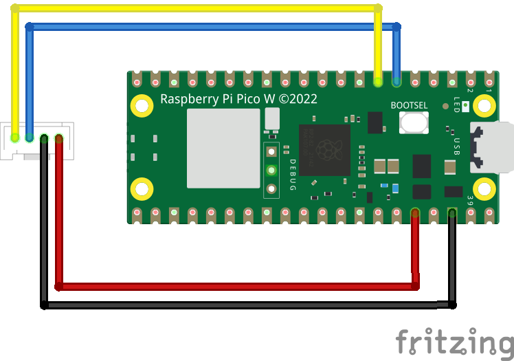

# How to attach the Useful Sensors' Person Sensor to a Pico via I2C

Example code that shows how to interface the Raspberry Pi Pico to the person 
sensor board. 

## Introduction

The Person Sensor is a small hardware module that's intended to make it easy to
find out when people are near a device, where they are, and who they are. It has
an image sensor and a microcontroller with pretrained ML models that use
computer vision to spot faces. 

There's a [detailed developer guide](https://usfl.ink/ps_dev)
available, but this project has sample code that shows you specifically how to 
get the sensor up and running with a Raspberry Pi Pico using C.

## Building

Make sure that you're able to build and run the standard Raspberry Pi Pico
examples, like `blink`. You can find general instructions on this in the 
[Pico Getting Started Guide](https://datasheets.raspberrypi.com/pico/getting-started-with-pico.pdf),
and [here's a Colab notebook that might help](https://usfl.ink/pico_blink_colab).
The main issues to watch out for are ensuring that `PICO_SDK_PATH` is set as an
environment variable, and points to the right location.

Once you're ready, run the following commands from within this repository's
folder to create the build files:

```bash
mkdir build
cd build
cmake ..
```

After that succeeds, you should be able to run the compilation stage:

```bash
make
```

There should now be a binary at `build/person_sensor_i2c.utf2`. You can install
this on your Pico board, though it won't work until you wire up the sensor to
the right pins.

## Wiring information

Wiring up the device requires 4 jumpers, to connect VDD, GND, SDA and SCL. The example here uses I2C port 0, which is assigned to GPIO 4 (SDA) and 5 (SCL) in software. Power is supplied from the VSYS pin.

Follow the wiring scheme shown below:



If you're using [Qwiic connectors](https://www.sparkfun.com/qwiic), the colors 
will be black for GND, red for 3.3V, blue for SDA, and yellow for SDC.

## Running

Once you have the sensor wired up, connect the Pico over USB while holding the
`bootsel` button to mount it as a storage device, copy the UTF2 file over to it,
and it should begin running. To see the logging output you'll need to set up
`minicom` or a similar tool, and you should start to see information about the
faces it spots, or error messages.